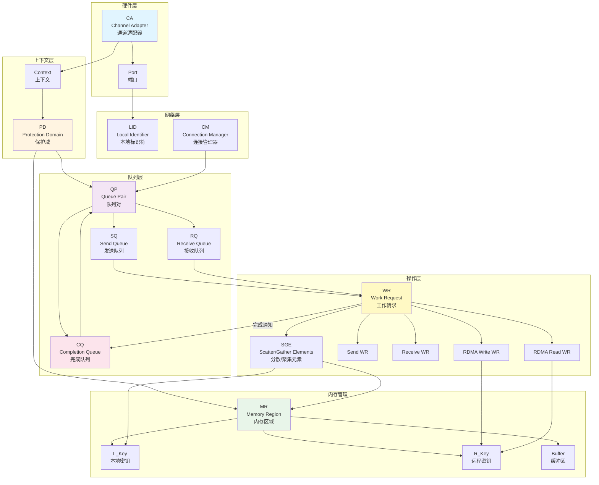
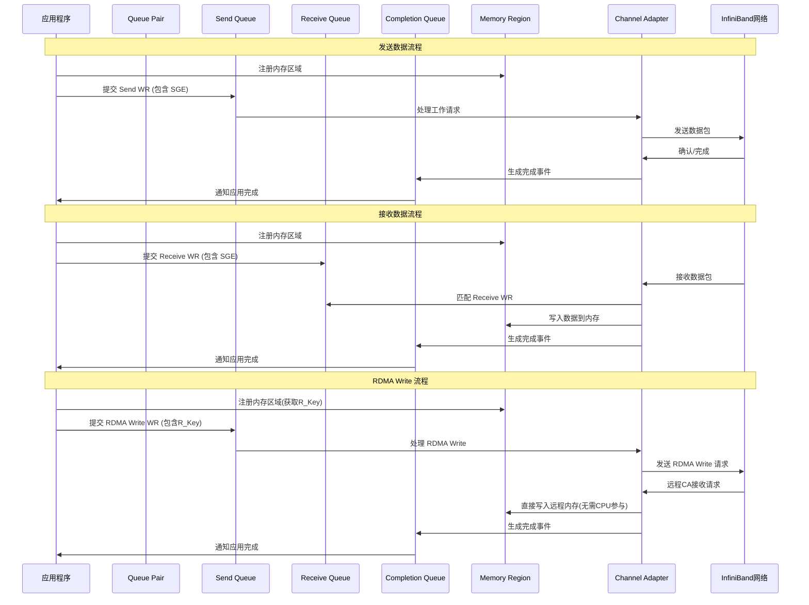
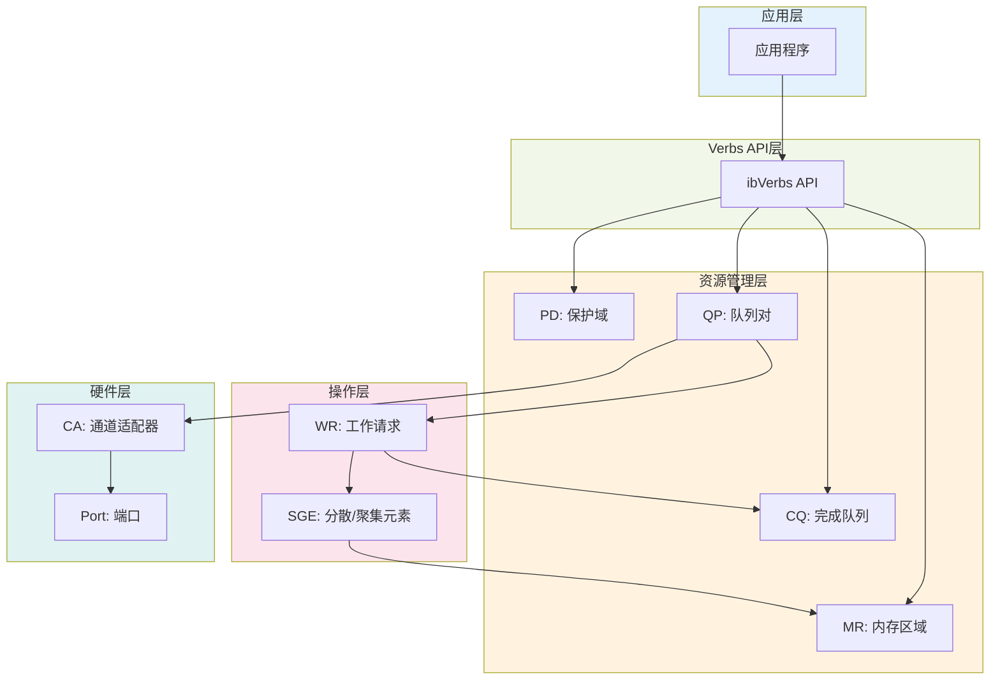

## 概述

InfiniBand 是一种高性能计算机网络通信标准，具有极高的吞吐量和极低的延迟。本文介绍 InfiniBand/RDMA 编程中的关键概念及其相互关系。

## 核心概念

### 1. CA (Channel Adapter) - 通道适配器
CA 是 InfiniBand 网络接口卡（NIC），是硬件层面的概念。每个 CA 都有一个或多个端口（Port），用于连接到 InfiniBand 网络。

### 2. PD (Protection Domain) - 保护域
保护域是一个安全边界，用于将 QP（队列对）和 MR（内存区域）组织在一起。只有属于同一个 PD 的 QP 和 MR 才能相互操作，这提供了内存保护机制。

### 3. MR (Memory Region) - 内存区域
内存区域是一块经过注册的内存，网卡可以直接访问。每个 MR 包含：
- **L_Key (Local Key)**: 本地访问密钥，用于本地 QP 访问本地 MR
- **R_Key (Remote Key)**: 远程访问密钥，用于远程 QP 访问此 MR（通过 RDMA 操作）

### 4. QP (Queue Pair) - 队列对
队列对是 InfiniBand 通信的基本单位，由两个队列组成：
- **SQ (Send Queue)**: 发送队列，用于发送数据
- **RQ (Receive Queue)**: 接收队列，用于接收数据

每个 QP 必须属于一个 PD，并且可以关联多个 CQ。

### 5. CQ (Completion Queue) - 完成队列
完成队列用于接收工作请求（WR）的完成通知。当 WR 执行完成后，会在对应的 CQ 中生成一个完成事件（Completion Event）。

### 6. WR (Work Request) - 工作请求
工作请求是提交到 QP 的操作指令，包括：
- Send WR: 发送请求
- Receive WR: 接收请求
- RDMA Write WR: RDMA 写请求
- RDMA Read WR: RDMA 读请求

### 7. SGE (Scatter/Gather Elements) - 分散/聚集元素
SGE 描述了一个内存缓冲区的位置和大小，包含：
- 地址（Address）
- 长度（Length）
- L_Key（用于验证访问权限）

一个 WR 可以包含多个 SGE，实现分散/聚集 I/O。

### 8. LID (Local Identifier) - 本地标识符
LID 是 InfiniBand 网络中每个端口的唯一标识符，用于路由数据包。

### 9. CM (Connection Manager) - 连接管理器
连接管理器负责建立和管理 QP 之间的连接，处理连接建立、断开等事件。

## PD 和 MR 关系图

以下 ASCII 图详细说明了 PD（保护域）和 MR（内存区域）之间的关系：

```
┌─────────────────────────────────────────────────────────────────────┐
│                        应用程序进程                                  │
└─────────────────────────────────────────────────────────────────────┘
                              │
                              │ 创建资源
                              ▼
┌─────────────────────────────────────────────────────────────────────┐
│                         Context (上下文)                             │
│                    (ibv_open_device 创建)                            │
└─────────────────────────────────────────────────────────────────────┘
                              │
                              │ 分配保护域
                              ▼
        ┌─────────────────────────────────────────┐
        │                                         │
        ▼                                         ▼
┌──────────────────┐                    ┌──────────────────┐
│   PD 1           │                    │   PD 2           │
│ (保护域 1)       │                    │ (保护域 2)       │
│                  │                    │                  │
│ ┌──────────────┐ │                    │ ┌──────────────┐ │
│ │   MR 1       │ │                    │ │   MR 3       │ │
│ │  L_Key: 0x01 │ │                    │ │  L_Key: 0x05 │ │
│ │  R_Key: 0x81 │ │                    │ │  R_Key: 0x85 │ │
│ └──────────────┘ │                    │ └──────────────┘ │
│                  │                    │                  │
│ ┌──────────────┐ │                    │ ┌──────────────┐ │
│ │   MR 2       │ │                    │ │   MR 4       │ │
│ │  L_Key: 0x02 │ │                    │ │  L_Key: 0x06 │ │
│ │  R_Key: 0x82 │ │                    │ │  R_Key: 0x86 │ │
│ └──────────────┘ │                    │ └──────────────┘ │
│                  │                    │                  │
│ ┌──────────────┐ │                    │ ┌──────────────┐ │
│ │   QP 1       │ │                    │ │   QP 3       │ │
│ │  (队列对 1)  │ │                    │ │  (队列对 3)  │ │
│ └──────────────┘ │                    │ └──────────────┘ │
│                  │                    │                  │
│ ┌──────────────┐ │                    │ ┌──────────────┐ │
│ │   QP 2       │ │                    │ │   QP 4       │ │
│ │  (队列对 2)  │ │                    │ │  (队列对 4)  │ │
│ └──────────────┘ │                    │ └──────────────┘ │
└──────────────────┘                    └──────────────────┘
        │                                         │
        │ 安全边界                                │ 安全边界
        │ (隔离)                                  │ (隔离)
        └─────────────────────────────────────────┘
                              │
                              │ 硬件访问
                              ▼
                    ┌──────────────────┐
                    │   CA (网卡)      │
                    └──────────────────┘

关键关系说明：
═══════════════════════════════════════════════════════════════════

1. PD 作为安全边界
   ─────────────────
   • PD 1 和 PD 2 相互隔离，互不干扰
   • 每个 PD 内的资源（MR、QP）只能在该 PD 内使用

2. MR 属于 PD
   ────────────
   • MR 1 和 MR 2 属于 PD 1
   • MR 3 和 MR 4 属于 PD 2
   • 每个 MR 都有唯一的 L_Key 和 R_Key

3. QP 属于 PD
   ────────────
   • QP 1 和 QP 2 属于 PD 1
   • QP 3 和 QP 4 属于 PD 2
   • QP 只能访问同一 PD 内的 MR

4. 访问规则
   ─────────
   ✅ 允许：QP 1 → MR 1 (同一 PD)
   ✅ 允许：QP 1 → MR 2 (同一 PD)
   ✅ 允许：QP 2 → MR 1 (同一 PD)
   ❌ 禁止：QP 1 → MR 3 (不同 PD)
   ❌ 禁止：QP 3 → MR 1 (不同 PD)

5. 内存保护机制
   ──────────────
   • L_Key: 用于本地 QP 访问本地 MR
     - QP 1 使用 L_Key 0x01 访问 MR 1
     - QP 1 使用 L_Key 0x02 访问 MR 2
   
   • R_Key: 用于远程 RDMA 操作
     - 远程 QP 使用 R_Key 0x81 进行 RDMA Write/Read 到 MR 1
     - 远程 QP 使用 R_Key 0x82 进行 RDMA Write/Read 到 MR 2

6. 实际应用场景
   ──────────────
   • 多租户隔离：不同应用使用不同 PD，确保安全隔离
   • 资源管理：同一应用的不同模块可以使用不同 PD
   • 权限控制：通过 PD 限制哪些 QP 可以访问哪些 MR
```

## 概念关系图

以下 Mermaid 图表展示了 InfiniBand 关键概念之间的关系：



## 数据流关系图

以下图表展示了数据在 InfiniBand 系统中的流动路径：



## 层次结构图

以下图表展示了 InfiniBand 编程模型的层次结构：



## 关键概念总结表

| 概念 | 英文全称 | 作用 | 关联对象 |
|------|---------|------|---------|
| CA | Channel Adapter | 硬件网卡 | Port |
| PD | Protection Domain | 安全边界 | QP, MR |
| MR | Memory Region | 注册的内存区域 | PD, L_Key, R_Key |
| QP | Queue Pair | 通信端点 | PD, SQ, RQ, CQ |
| SQ | Send Queue | 发送队列 | QP |
| RQ | Receive Queue | 接收队列 | QP |
| CQ | Completion Queue | 完成队列 | QP, WR |
| WR | Work Request | 工作请求 | QP, SGE |
| SGE | Scatter/Gather Elements | 内存描述符 | MR, L_Key |
| L_Key | Local Key | 本地访问密钥 | MR |
| R_Key | Remote Key | 远程访问密钥 | MR |
| LID | Local Identifier | 本地标识符 | Port |
| CM | Connection Manager | 连接管理器 | QP |

## 编程流程

典型的 InfiniBand 编程流程：

1. **打开设备**: `ibv_open_device()` - 获取 Context
2. **分配保护域**: `ibv_alloc_pd()` - 创建 PD
3. **注册内存**: `ibv_reg_mr()` - 创建 MR，获得 L_Key 和 R_Key
4. **创建完成队列**: `ibv_create_cq()` - 创建 CQ
5. **创建队列对**: `ibv_create_qp()` - 创建 QP，关联 CQ
6. **建立连接**: 使用 CM 或手动配置 QP 状态
7. **提交工作请求**: `ibv_post_send()`, `ibv_post_recv()` - 提交 WR
8. **轮询完成**: `ibv_poll_cq()` - 检查完成事件
9. **清理资源**: 销毁 QP, CQ, MR, PD，关闭设备

## 参考资料

- [RDMA Aware Networks Programming User Manual](https://docs.nvidia.com/networking/display/rdmaawareprogrammingv17)
- [Linux Kernel InfiniBand Documentation](https://docs.kernel.org/infiniband/index.html)
- [ibVerbs Manual Pages](https://man7.org/linux/man-pages/man3/ibv_post_send.3.html)
