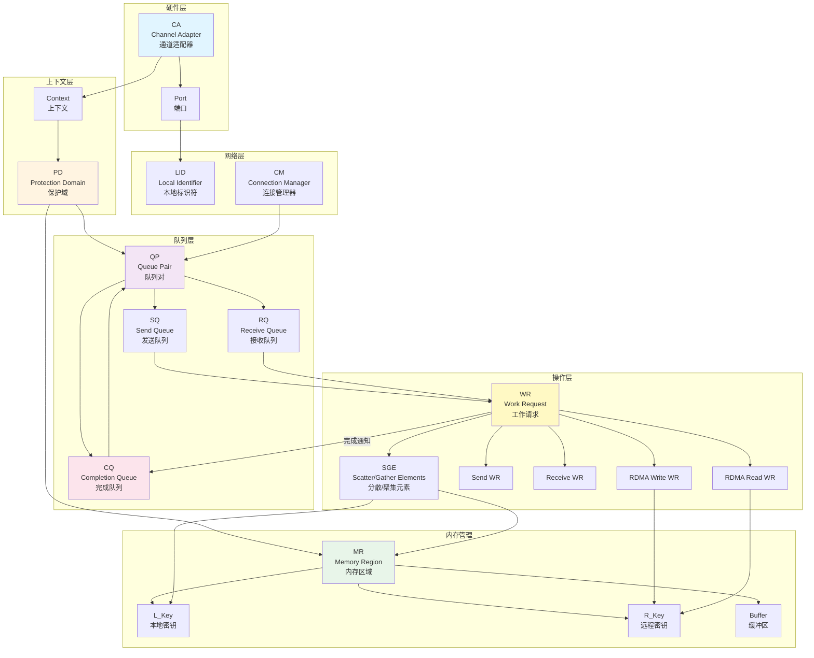
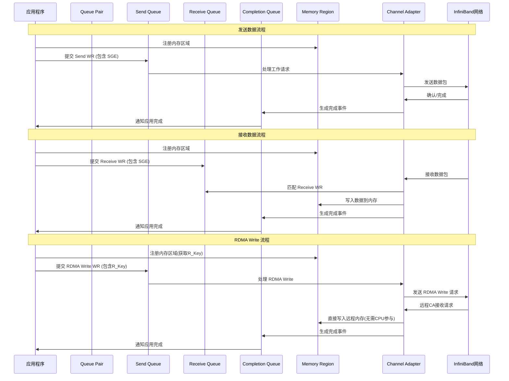
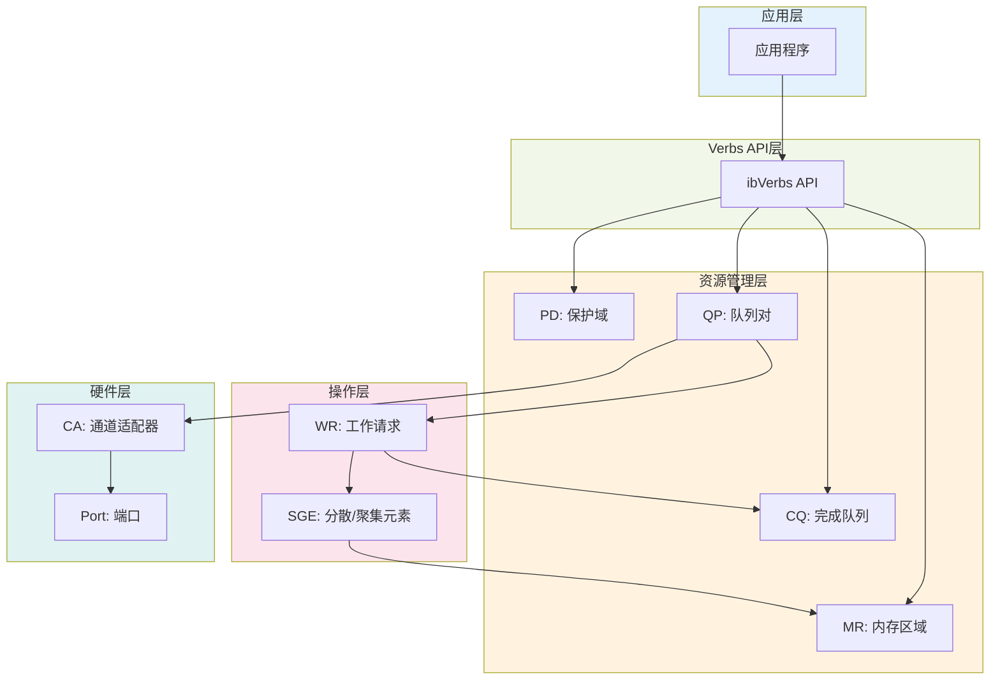

## 概述

InfiniBand 是一种高性能计算机网络通信标准，具有极高的吞吐量和极低的延迟。本文介绍 InfiniBand/RDMA 编程中的关键概念及其相互关系。

## 核心概念

### 1. CA (Channel Adapter) - 通道适配器
CA 是 InfiniBand 网络接口卡（NIC），是硬件层面的概念。每个 CA 都有一个或多个端口（Port），用于连接到 InfiniBand 网络。

### 2. PD (Protection Domain) - 保护域
保护域是一个安全边界，用于将 QP（队列对）和 MR（内存区域）组织在一起。只有属于同一个 PD 的 QP 和 MR 才能相互操作，这提供了内存保护机制。

### 3. MR (Memory Region) - 内存区域
内存区域是一块经过注册的内存，网卡可以直接访问。每个 MR 包含：
- **L_Key (Local Key)**: 本地访问密钥，用于本地 QP 访问本地 MR
- **R_Key (Remote Key)**: 远程访问密钥，用于远程 QP 访问此 MR（通过 RDMA 操作）

### 4. QP (Queue Pair) - 队列对
队列对是 InfiniBand 通信的基本单位，由两个队列组成：
- **SQ (Send Queue)**: 发送队列，用于发送数据
- **RQ (Receive Queue)**: 接收队列，用于接收数据

每个 QP 必须属于一个 PD，并且可以关联多个 CQ。

### 5. CQ (Completion Queue) - 完成队列
完成队列用于接收工作请求（WR）的完成通知。当 WR 执行完成后，会在对应的 CQ 中生成一个完成事件（Completion Event）。

### 6. WR (Work Request) - 工作请求
工作请求是提交到 QP 的操作指令，包括：
- Send WR: 发送请求
- Receive WR: 接收请求
- RDMA Write WR: RDMA 写请求
- RDMA Read WR: RDMA 读请求

### 7. SGE (Scatter/Gather Elements) - 分散/聚集元素
SGE 描述了一个内存缓冲区的位置和大小，包含：
- 地址（Address）
- 长度（Length）
- L_Key（用于验证访问权限）

一个 WR 可以包含多个 SGE，实现分散/聚集 I/O。

### 8. LID (Local Identifier) - 本地标识符
LID 是 InfiniBand 网络中每个端口的唯一标识符，用于路由数据包。

### 9. AH (Address Handle) - 地址句柄
地址句柄用于 UD (Unreliable Datagram) 传输类型，包含目标地址信息。每个 AH 属于一个 PD，用于在 UD QP 发送数据时指定目标地址。AH 包含：
- 目标 LID (Local Identifier)
- 服务级别 (Service Level)
- 路径位 (Path Bits)
- 全局路由头 (GRH) 信息（如果使用）

### 10. CM (Connection Manager) - 连接管理器
连接管理器负责建立和管理 QP 之间的连接，处理连接建立、断开等事件。

## 保护域（PD）资源组织结构图

以下 ASCII 图详细说明了 PD（保护域）内资源的结构和关系：

**重要说明**：图中 CQ 显示在 PD 内是为了展示逻辑关联关系。实际上：
- CQ 通过 Context 创建（`ibv_create_cq()`），不属于任何 PD
- CQ 是 Context 级别的资源，可以被不同 PD 的 QP 共享
- 多个 QP（即使属于不同的 PD）可以关联到同一个 CQ
- 例如：PD 1 的 QP 1、QP 2 和 PD 2 的 QP 3、QP 4 可以共享同一个 CQ

```
┌─────────────────────────────────────────────────────────────────────┐
│                      Application Process                           │
└─────────────────────────────────────────────────────────────────────┘
                              │
                              │ ibv_open_device()
                              ▼
┌─────────────────────────────────────────────────────────────────────┐
│                         Context                                     │
└─────────────────────────────────────────────────────────────────────┘
                              │
                              │ ibv_alloc_pd()
                              ▼
        ┌─────────────────────────────────────────────────────────┐
        │                                                         │
        ▼                                                         ▼
┌──────────────────────────────────────┐    ┌──────────────────────────────────────┐
│         PD 1 (Protection Domain)     │    │         PD 2 (Protection Domain)     │
│                                      │    │                                      │
│  Resources in PD 1:                  │    │  Resources in PD 2:                 │
│                                      │    │                                      │
│  ┌────────────────────────────────┐  │    │  ┌────────────────────────────────┐  │
│  │  MR 1                          │  │    │  │  MR 3                          │  │
│  │  L_Key: 0x01  R_Key: 0x81      │  │    │  │  L_Key: 0x05  R_Key: 0x85     │  │
│  └────────────────────────────────┘  │    │  └────────────────────────────────┘  │
│                                      │    │                                      │
│  ┌────────────────────────────────┐  │    │  ┌────────────────────────────────┐  │
│  │  MR 2                          │  │    │  │  MR 4                          │  │
│  │  L_Key: 0x02  R_Key: 0x82      │  │    │  │  L_Key: 0x06  R_Key: 0x86     │  │
│  └────────────────────────────────┘  │    │  └────────────────────────────────┘  │
│                                      │    │                                      │
│  ┌────────────────────────────────┐  │    │  ┌────────────────────────────────┐  │
│  │  AH 1                          │  │    │  │  AH 3                          │  │
│  │  Target LID, Service Level     │  │    │  │  Target LID, Service Level     │  │
│  └────────────────────────────────┘  │    │  └────────────────────────────────┘  │
│                                      │    │                                      │
│  ┌────────────────────────────────┐  │    │  ┌────────────────────────────────┐  │
│  │  AH 2                          │  │    │  │  AH 4                          │  │
│  │  Target LID, Service Level     │  │    │  │  Target LID, Service Level     │  │
│  └────────────────────────────────┘  │    │  └────────────────────────────────┘  │
│                                      │    │                                      │
│  ┌────────────────────────────────┐  │    │  ┌────────────────────────────────┐  │
│  │  QP 1                          │  │    │  │  QP 3                          │  │
│  │  Uses: MR 1/2, AH 1/2, CQ 1    │  │    │  │  Uses: MR 3/4, AH 3/4, CQ 1/2  │  │
│  └────────────────────────────────┘  │    │  └────────────────────────────────┘  │
│                                      │    │                                      │
│  ┌────────────────────────────────┐  │    │  ┌────────────────────────────────┐  │
│  │  QP 2                          │  │    │  │  QP 4                          │  │
│  │  Uses: MR 1/2, AH 1/2, CQ 1    │  │    │  │  Uses: MR 3/4, AH 3/4, CQ 1/2  │  │
│  └────────────────────────────────┘  │    │  └────────────────────────────────┘  │
│                                      │    │                                      │
└──────────────────────────────────────┘    └──────────────────────────────────────┘
        │                                                         │
        │  Security Boundary                                      │  Security Boundary
        └─────────────────────────────────────────────────────────┘
                              │
                              │
                              ▼
┌───────────────────────────────────────────────────────────────────┐
│  CQ (Created via Context, NOT belonging to any PD)                │
│  CQ can be shared by QP from different PDs!                       │
│                                                                   │
│  ┌──────────────────────────────────────────────────────────────┐ │
│  │  CQ 1 (Shared across PDs)                                    │ │
│  │  Receives completions from:                                  │ │
│  │    - QP 1 (PD 1)                                             │ │
│  │    - QP 2 (PD 1)                                             │ │
│  │    - QP 3 (PD 2)  ← Cross-PD sharing                         │ │
│  │    - QP 4 (PD 2)  ← Cross-PD sharing                         │ │
│  └──────────────────────────────────────────────────────────────┘ │
│                                                                   │
│  ┌──────────────────────────────────────────────────────────────┐ │
│  │  CQ 2 (Alternative: separate CQ for PD 2)                    │ │
│  │  Receives completions from:                                  │ │
│  │    - QP 3 (PD 2)                                             │ │
│  │    - QP 4 (PD 2)                                             │ │
│  └──────────────────────────────────────────────────────────────┘ │
└───────────────────────────────────────────────────────────────────┘
                              │
                              │ Hardware Access
                              ▼
                    ┌──────────────────┐
                    │  CA (NIC)        │
                    └──────────────────┘

资源使用关系：
─────────────────────────────
QP 1 (PD 1) ──使用──> MR 1, MR 2, AH 1, AH 2
QP 1 (PD 1) ──发送完成事件到──> CQ 1

QP 2 (PD 1) ──使用──> MR 1, MR 2, AH 1, AH 2
QP 2 (PD 1) ──发送完成事件到──> CQ 1

QP 3 (PD 2) ──使用──> MR 3, MR 4, AH 3, AH 4
QP 3 (PD 2) ──发送完成事件到──> CQ 1 (共享) 或 CQ 2

QP 4 (PD 2) ──使用──> MR 3, MR 4, AH 3, AH 4
QP 4 (PD 2) ──发送完成事件到──> CQ 1 (共享) 或 CQ 2

关键点：CQ 可以被不同 PD 的 QP 共享！

关键关系说明：
═══════════════════════════════════════════════════════════════════

1. PD 作为安全边界
   ─────────────────
   • PD 1 和 PD 2 相互隔离，互不干扰
   • PD 直接管理的资源：MR、QP、AH
   • CQ 通过 Context 创建，通过 QP 间接关联到 PD（QP 创建时指定 CQ）
   • 只有属于同一个 PD 的 QP 和 MR 才能相互操作
   • PD 提供了内存和队列的访问控制机制

2. MR (Memory Region) - 内存区域
   ──────────────────────────────
   • MR 1 和 MR 2 属于 PD 1
   • MR 3 和 MR 4 属于 PD 2
   • 每个 MR 都有唯一的 L_Key（本地密钥）和 R_Key（远程密钥）
   • MR 是 QP 可以访问的内存区域

3. QP (Queue Pair) - 队列对
   ──────────────────────────
   • QP 1 和 QP 2 属于 PD 1
   • QP 3 和 QP 4 属于 PD 2
   • 每个 QP 包含：
     - SQ (Send Queue): 发送队列，用于发送数据
     - RQ (Receive Queue): 接收队列，用于接收数据
   • QP 只能访问同一 PD 内的 MR

4. CQ (Completion Queue) - 完成队列
   ──────────────────────────────────
   • CQ 通过 Context 创建（`ibv_create_cq()`），不属于任何 PD
   • CQ 是 Context 级别的资源，可以被不同 PD 的 QP 共享
   • 多个 QP（即使属于不同的 PD）可以关联到同一个 CQ
   • 示例：
     - CQ 1 可以同时接收 PD 1 的 QP 1、QP 2 和 PD 2 的 QP 3、QP 4 的完成事件
     - 这种设计提供了灵活性，允许跨 PD 共享完成队列
   • 注意：虽然图中 CQ 显示在 PD 内，但这是逻辑关联，CQ 本身不属于 PD

   QP 如何将完成事件发送到 CQ：
   ────────────────────────────────
   1. QP 创建时关联 CQ：
      - 创建 QP 时，在 `ibv_qp_init_attr` 中指定 `send_cq` 和 `recv_cq`
      - 每个 QP 可以有不同的 send_cq 和 recv_cq，也可以使用同一个 CQ
   
   2. WR 标志控制完成事件生成：
      - Send WR：设置 `IBV_SEND_SIGNALED` 标志，完成后在 send_cq 中生成 CQE
      - Receive WR：总是生成完成事件（在 recv_cq 中生成 CQE）
      - 未设置 SIGNALED 的 Send WR 不会生成完成事件
   
   3. 硬件自动生成完成事件：
      - 当 WR 执行完成后，硬件（CA）自动在对应的 CQ 中生成 CQE（Completion Queue Entry）
      - CQE 包含：状态码、操作类型、WR ID、字节数等信息
      - 应用程序通过 `ibv_poll_cq()` 轮询 CQ 获取完成事件
   
   4. 完成事件流程：
      Application → ibv_post_send/recv() → QP (SQ/RQ)
                                                      ↓
                                              WR 执行完成
                                                      ↓
                                             硬件生成 CQE
                                                      ↓
                                             写入到 CQ
                                                      ↓
                                      Application ← ibv_poll_cq()

5. AH (Address Handle) - 地址句柄
   ────────────────────────────────
   • AH 1 和 AH 2 属于 PD 1
   • AH 3 和 AH 4 属于 PD 2
   • AH 主要用于 UD (Unreliable Datagram) 传输类型
   • UD QP 发送数据时，WR 必须包含 AH 来指定目标地址
   • AH 包含目标 LID、服务级别等路由信息

6. WR (Work Request) - 工作请求
   ──────────────────────────────
   • WR 提交到 QP 的 SQ 或 RQ
   • WR 包含一个或多个 SGE（Scatter/Gather Elements）
   • SGE 引用 MR，使用 L_Key 验证访问权限
   • UD QP 的 Send WR 必须包含 AH 来指定目标地址

7. 访问规则
   ─────────
   ✅ 允许：QP 1 → MR 1 (同一 PD)
   ✅ 允许：QP 1 → MR 2 (同一 PD)
   ✅ 允许：QP 2 → MR 1 (同一 PD)
   ✅ 允许：QP 2 → MR 2 (同一 PD)
   ✅ 允许：QP 3 → MR 3 (同一 PD)
   ✅ 允许：QP 3 → MR 4 (同一 PD)
   ✅ 允许：QP 4 → MR 3 (同一 PD)
   ✅ 允许：QP 4 → MR 4 (同一 PD)
   ✅ 允许：QP 1 → CQ 1 (CQ 可以被不同 PD 共享)
   ✅ 允许：QP 2 → CQ 1 (CQ 可以被不同 PD 共享)
   ✅ 允许：QP 3 → CQ 1 (CQ 可以被不同 PD 共享，跨 PD)
   ✅ 允许：QP 3 → CQ 2 (CQ 可以被不同 PD 共享)
   ✅ 允许：QP 4 → CQ 1 (CQ 可以被不同 PD 共享，跨 PD)
   ✅ 允许：QP 4 → CQ 2 (CQ 可以被不同 PD 共享)
   ✅ 允许：QP 1 → AH 1 (同一 PD，UD QP)
   ✅ 允许：QP 1 → AH 2 (同一 PD，UD QP)
   ✅ 允许：QP 2 → AH 1 (同一 PD，UD QP)
   ✅ 允许：QP 2 → AH 2 (同一 PD，UD QP)
   ✅ 允许：QP 3 → AH 3 (同一 PD，UD QP)
   ✅ 允许：QP 3 → AH 4 (同一 PD，UD QP)
   ✅ 允许：QP 4 → AH 3 (同一 PD，UD QP)
   ✅ 允许：QP 4 → AH 4 (同一 PD，UD QP)
   ❌ 禁止：QP 1 → MR 3 (不同 PD)
   ❌ 禁止：QP 1 → MR 4 (不同 PD)
   ❌ 禁止：QP 3 → MR 1 (不同 PD)
   ❌ 禁止：QP 3 → MR 2 (不同 PD)
   ❌ 禁止：QP 1 → AH 3 (不同 PD)
   ❌ 禁止：QP 1 → AH 4 (不同 PD)
   ❌ 禁止：QP 3 → AH 1 (不同 PD)
   ❌ 禁止：QP 3 → AH 2 (不同 PD)

8. 内存保护机制
   ──────────────
   • L_Key: 用于本地 QP 访问本地 MR
     - QP 1 使用 L_Key 0x01 访问 MR 1
     - QP 1 使用 L_Key 0x02 访问 MR 2
     - SGE 中必须包含正确的 L_Key 才能访问 MR
   
   • R_Key: 用于远程 RDMA 操作
     - 远程 QP 使用 R_Key 0x81 进行 RDMA Write/Read 到 MR 1
     - 远程 QP 使用 R_Key 0x82 进行 RDMA Write/Read 到 MR 2
     - RDMA 操作时，远程端必须提供正确的 R_Key

9. 资源创建顺序
   ──────────────
   1. 创建 Context (ibv_open_device)
   2. 创建 PD (ibv_alloc_pd)
   3. 注册 MR (ibv_reg_mr) - 需要 PD
   4. 创建 CQ (ibv_create_cq) - 需要 Context
   5. 创建 AH (ibv_create_ah) - 需要 PD（仅 UD QP 需要）
   6. 创建 QP (ibv_create_qp) - 需要 PD 和 CQ
   7. 提交 WR (ibv_post_send/recv) - 需要 QP 和 MR（UD QP 还需要 AH）

10. 实际应用场景
   ──────────────
   • 多租户隔离：不同应用使用不同 PD，确保安全隔离
   • 资源管理：同一应用的不同模块可以使用不同 PD
   • 权限控制：通过 PD 限制哪些 QP 可以访问哪些 MR
   • 性能优化：合理组织 PD 内的资源，减少跨 PD 访问开销
```

## 概念关系图

以下 Mermaid 图表展示了 InfiniBand 关键概念之间的关系：



## 数据流关系图

以下图表展示了数据在 InfiniBand 系统中的流动路径：



## 层次结构图

以下图表展示了 InfiniBand 编程模型的层次结构：



## 关键概念总结表

| 概念 | 英文全称 | 作用 | 关联对象 |
|------|---------|------|---------|
| CA | Channel Adapter | 硬件网卡 | Port |
| PD | Protection Domain | 安全边界 | QP, MR, AH (CQ通过QP间接关联) |
| MR | Memory Region | 注册的内存区域 | PD, L_Key, R_Key |
| QP | Queue Pair | 通信端点 | PD, SQ, RQ, CQ |
| SQ | Send Queue | 发送队列 | QP |
| RQ | Receive Queue | 接收队列 | QP |
| CQ | Completion Queue | 完成队列 | QP, WR |
| AH | Address Handle | 地址句柄 | PD, UD QP |
| WR | Work Request | 工作请求 | QP, SGE, AH |
| SGE | Scatter/Gather Elements | 内存描述符 | MR, L_Key |
| L_Key | Local Key | 本地访问密钥 | MR |
| R_Key | Remote Key | 远程访问密钥 | MR |
| LID | Local Identifier | 本地标识符 | Port |
| CM | Connection Manager | 连接管理器 | QP |

## 编程流程

典型的 InfiniBand 编程流程：

1. **打开设备**: `ibv_open_device()` - 获取 Context
2. **分配保护域**: `ibv_alloc_pd()` - 创建 PD
3. **注册内存**: `ibv_reg_mr()` - 创建 MR，获得 L_Key 和 R_Key
4. **创建完成队列**: `ibv_create_cq()` - 创建 CQ
5. **创建地址句柄**: `ibv_create_ah()` - 创建 AH（仅 UD QP 需要）
6. **创建队列对**: `ibv_create_qp()` - 创建 QP，关联 CQ
7. **建立连接**: 使用 CM 或手动配置 QP 状态
8. **提交工作请求**: `ibv_post_send()`, `ibv_post_recv()` - 提交 WR（UD QP 的 Send WR 需要包含 AH）
9. **轮询完成**: `ibv_poll_cq()` - 检查完成事件
10. **清理资源**: 销毁 QP, AH, CQ, MR, PD，关闭设备

## 参考资料

- [RDMA Aware Networks Programming User Manual](https://docs.nvidia.com/networking/display/rdmaawareprogrammingv17)
- [Linux Kernel InfiniBand Documentation](https://docs.kernel.org/infiniband/index.html)
- [ibVerbs Manual Pages](https://man7.org/linux/man-pages/man3/ibv_post_send.3.html)
