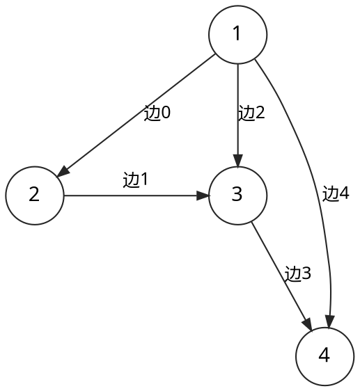

本章介绍图的存储方式。

## 边集

### 方法

使用一个数组来存储边，数组中每个元素都包含一条边的起点和终点（带边权的图还包括边权）。
（或者使用多个数组来分别存储起点、终点和边权）。

### 复杂度

- 查询是否存在某条边：𝑂(𝑚)
- 遍历一个点的所有出边：𝑂(𝑚)
- 遍历整张图：𝑂(𝑛𝑚)
- 空间复杂度：𝑂(𝑚)

### 应用

由于直接存边的遍历效率低下，一般不用于遍历图．

在 Kruskal 算法 中，由于需要将边按边权排序，需要直接存边．

在有的题目中，需要多次建图（如建一遍原图，建一遍反图），此时既可以使用多个其它数据结构来同时存储多张图，也可以将边直接存下来，需要重新建图时利用直接存下的边来建图．

## 邻接矩阵

TODO

## 邻接表

## 链式前向星（静态邻接表）

链式前向星是一种利用**数组模拟链表**来实现的图存储结构，也常被称为“静态邻接表”。它完美结合了邻接表（节省空间、方便遍历出边）和数组（内存连续、常数极小）的优点，是算法竞赛和图论编程中最常用的建图方式之一。

---

### 1. 核心数据结构

链式前向星由一个边计数器和若干数组组成。理解关键在于分清**下标**：`head` 按节点索引，其余按边索引。

- **`cnt`（边计数器）**：当前边数，用于分配下一条边的编号，通常从 `0` 起。

| 数组 | 下标 | 存值 | 作用 |
| --- | --- | --- | --- |
| `head` | 节点 `u` | 边编号 `i` | 节点 `u` 出边链表的入口（桥接到 `to`/`next`） |
| `to` | 边 `i` | 节点 `v` | 第 `i` 条边的终点 |
| `next` | 边 `i` | 边编号 `j` | 当前边 `i`（以 `head[u]` 为共同起点）的下一条边 |
| `weight` | 边 `i` | 边权 | 第 `i` 条边的权重（可选） |

> **注**：`u` 可从 `1` 开始，故 `head` 大小至少为 `N + 1`（竞赛常取 `N + 5` 防越界，如 `MAXN = 10005`）。
>
> **注**：节点编号若是巨大离散数（如 `1000000007`）或字符串（如 `"Beijing"`），不能直接作数组下标，需先离散化：
> 1. 用哈希表（如 `std::unordered_map<string, int>`）给每个新节点分配连续整数 ID（从 `0` 或 `1` 起）；
> 2. 用该 ID 作为 `u`，再代入 `head` 建图。

---

### 2. 举例说明

我们以一个包含 **4个节点、5条边** 的例子，通过图解直观地“看”到链式前向星在内存中的样子和逻辑上的链表样子。

#### 1. 逻辑上的图

这是我们人类大脑中理解的图结构（括号内为边的编号 `cnt`）：



---

#### 2. 内存中的物理结构（数组存储）

在计算机内存中，它们是三排紧挨着的格子。我们把相同下标（边编号）的格子对齐：

**起点的头指针（head）**：

```text
节点 u:     [ 1 ]    [ 2 ]    [ 3 ]    [ 4 ]
--------------------------------------------
head[u]:    [ 4 ]    [ 1 ]    [ 3 ]    [-1 ]
```

**边的属性（平行数组 to, weight, next）**：

```text
边编号 i:     [ 0 ]    [ 1 ]    [ 2 ]    [ 3 ]    [ 4 ]
-------------------------------------------------------
to[i]:       [ 2 ]    [ 3 ]    [ 3 ]    [ 4 ]    [ 4 ]
weight[i]:   [ 10]    [ 20]    [ 30]    [ 40]    [ 50]
next[i]:     [-1 ]    [-1 ]    [ 0 ]    [-1 ]    [ 2 ]
```

---

#### 3. 链式前向星的灵魂：指针跳转图解

这是最核心的部分。我们将 `head` 数组作为入口，`next` 数组作为指针，把上面的物理内存**在逻辑上连成多条单链表**。

每一个方块代表一条边，格式为 `[ 边编号 | 终点 to | 权重 w | 下一条边 next ]`。

##### 🔹 节点 1 的出边链表（倒序连接）

当你访问 `head[1]` 时，顺藤摸瓜的轨迹如下：

```text
         +-------------+      +-------------+      +-------------+
head[1]  |    边 4     |      |    边 2     |      |    边 0     |
------>  | to: 4       |      | to: 3       |      | to: 2       |
         | w : 50      |      | w : 30      |      | w : 10      |
         | next: 2   --+----> | next: 0   --+----> | next:-1 (终)+----> NULL
         +-------------+      +-------------+      +-------------+
```

*你可以看到，由于是“头插法”，最后输入的“边4”排在链表最前面，它指向“边2”，然后指向最早输入的“边0”。*

##### 🔹 节点 2 的出边链表

```text
         +-------------+
head[2]  |    边 1     |
------>  | to: 3       |
         | w : 20      |
         | next:-1   --+----> NULL
         +-------------+
```

##### 🔹 节点 3 的出边链表

```text
         +-------------+
head[3]  |    边 3     |
------>  | to: 4       |
         | w : 40      |
         | next:-1   --+----> NULL
         +-------------+
```

##### 🔹 节点 4 的出边链表

```text
head[4]
------>  -1 (即 NULL，表示没有任何以节点 4 为起点的边)

```


---

### 4. 建图过程

核心代码

```cpp
// head[u] 和 cnt 的初始值都为 -1
void add(int u, int v) {
  nxt[++cnt] = head[u];  // 当前边（以 head[u] 为共同起点）的下一条边
  head[u] = cnt;         // 起点 u 的第一条边
  to[cnt] = v;           // 当前边的终点
}

// 遍历 u 的出边
for (int i = head[u]; ~i; i = nxt[i]) {  // ~i 表示 i != -1
  int v = to[i];
}
```

<details>
<summary>参考代码</summary>



</details>

### 参考

- [图的存储 · 链式前向星 - OI Wiki](https://oi-wiki.org/graph/save/#链式前向星)

